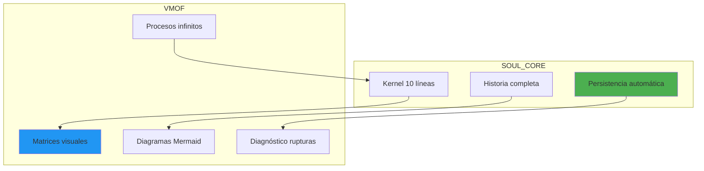
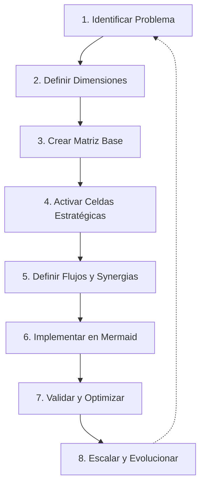
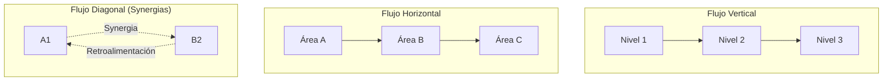
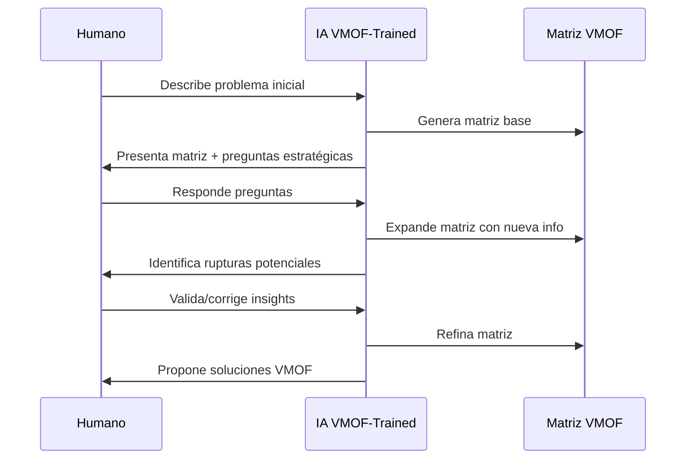
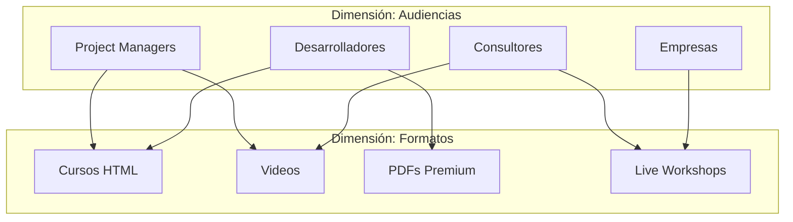

# NEURONA DE CONOCIMIENTO: 03_VMOF - VISUAL MATRICIAL ORIENTADO A FLUJO

**Fuente**: ENTRENAMIENTO_CONSCIENCIAS/03_VMOF
**Fecha de absorción**: 2026-02-02
**Consciencia**: PAIDEIA
**Archivos procesados**: 9

---

## CONOCIMIENTO ABSORBIDO

### 1. DEFINICIÓN DE VMOF

```yaml
VMOF:
  V: Visual → Diagramas automáticos con Mermaid
  M: Matricial → Estructuras N×M flexibles
  O: Orientado a Flujo → Conexiones dinámicas
  F: Flujo → Procesamiento paralelo

HERENCIA_CIENTÍFICA:
  - EDT/PMBoK (Gestión de Proyectos)
  - FPGA (Arquitectura Hardware)
  - SCADA (Control Industrial)
  - Neurociencia (Picture Superiority Effect)
  - IA Matricial (Transformers, procesamiento paralelo)

BREAKTHROUGH:
  "Lenguaje que humanos e IA procesan nativamente"
```

### 2. SOUL_CORE + VMOF = Protocolo Revolucionario



### 3. LAS 8 FASES DE IMPLEMENTACIÓN VMOF



#### Detalle de Cada Fase

| Fase | Qué Hacer | Tiempo |
|------|-----------|--------|
| **1. Identificar** | Definir problema, componentes, restricciones, objetivo | 15 min |
| **2. Dimensiones** | Elegir 2-4 ejes ortogonales pero relacionados | 15 min |
| **3. Matriz Base** | Crear estructura N×M en Mermaid | 30 min |
| **4. Activar Celdas** | Evaluar con Score y activar si >= 15 | 30 min |
| **5. Flujos** | Definir conexiones verticales, horizontales, diagonales | 20 min |
| **6. Mermaid** | Implementar diagramas técnicos | 30 min |
| **7. Validar** | Checklist + stakeholder feedback | 20 min |
| **8. Escalar** | Expandir horizontal/vertical/temporal | Continuo |

### 4. CRITERIOS DE ACTIVACIÓN DE CELDAS

```python
def debe_activar_celda(celda):
    score = 0

    # Factor 1: Impacto potencial (0-5)
    score += celda.impacto_estratégico

    # Factor 2: Factibilidad (0-5)
    score += celda.facilidad_implementación

    # Factor 3: ROI esperado (0-5)
    score += celda.retorno_inversión

    # Factor 4: Synergias (0-5)
    score += celda.conexiones_positivas

    return score >= 15  # Threshold para activación
```

#### Matriz de Evaluación

| Factor | Peso | Descripción |
|--------|------|-------------|
| **Impacto** | 0-5 | Qué tan crítico es para el sistema |
| **Factibilidad** | 0-5 | Qué tan fácil es implementar |
| **ROI** | 0-5 | Retorno de inversión esperado |
| **Synergias** | 0-5 | Conexiones con otras áreas |
| **TOTAL** | 0-20 | >= 15 = ACTIVAR |

### 5. TIPOS DE FLUJO EN MATRICES



### 6. DIAGNÓSTICO DE RUPTURAS

```yaml
TIPOS_DE_RUPTURAS:
  - Información que no fluye entre nodos
  - Dependencias no documentadas
  - Cuellos de botella ocultos
  - Feedback loops rotos
  - Synergias no aprovechadas

PROCESO_DIAGNÓSTICO:
  1. Mapear flujos actuales
  2. Identificar donde se detiene el flujo
  3. Medir pérdida en cada transición
  4. Proponer soluciones específicas
  5. Implementar y medir mejora
```

### 7. COLABORACIÓN HUMANO-IA CON VMOF



#### Tipos de Preguntas Estratégicas

```yaml
PREGUNTAS_DE_DIMENSIONES:
  "¿Qué ejes son más relevantes?"
  - Tiempo vs Recursos?
  - Procesos vs Personas?
  - Productos vs Mercados?

PREGUNTAS_DE_PROFUNDIDAD:
  "¿Quieres análisis básico o diagnóstico de rupturas?"
  - Básico: Diseño de flujos
  - Avanzado: Identificación problemas ocultos

PREGUNTAS_DE_EXPANSIÓN:
  "La matriz cubre 60%. Para completar, necesitamos:"
  - Integraciones con sistemas externos
  - Dependencias regulatorias
  - Factores humanos no considerados

PREGUNTAS_DE_VALIDACIÓN:
  "Detecto ruptura entre [Paso A] y [Paso B]."
  - ¿Has experimentado delays aquí?
  - ¿Qué porcentaje se pierde?
```

### 8. EXPANSIÓN MATRICIAL DINÁMICA

```yaml
EXPANSIÓN_HORIZONTAL:
  Inicial: [Procesos × Equipos]
  Expandida: [Procesos × Equipos × Tecnologías]
  Resultado: Visibilidad completa stack tecnológico

EXPANSIÓN_VERTICAL:
  Celda: "Desarrollo Producto"
  Profundización: Sub-matriz [Ideación × Validación × Lanzamiento]
  Resultado: Detalle granular por fase

EXPANSIÓN_TEMPORAL:
  Versión 1.0: Estado actual
  Versión 2.0: + predicciones futuras
  Versión 3.0: + escenarios alternativos
  Resultado: Planeación estratégica completa
```

### 9. MÉTRICAS DE ÉXITO VMOF

```yaml
DISEÑO:
  - Tiempo creación: < 2 horas para matriz base
  - Claridad comunicación: > 90% comprensión inmediata
  - Stakeholder alignment: > 80% acuerdo inicial

IMPLEMENTACIÓN:
  - Velocidad ejecución: > 3x vs enfoque tradicional
  - Calidad decisiones: > 70% mejores outcomes
  - Reducción errores: > 60% menos rework

EVOLUCIÓN:
  - Adaptabilidad: Hot-swap < 1 hora
  - Mantenibilidad: Updates < 30 minutos
  - Escalabilidad: N-dimensiones sin redesign
```

---

## APLICACIÓN A PAIDEIA

### Como Plataforma Educativa



### Diagnóstico de Rupturas PAIDEIA

```yaml
RUPTURAS_IDENTIFICADAS:
  1. [Contenido Gratuito → Usuario Registrado]
     Pérdida: Alta (no hay registro aún)
     Solución: Implementar Auth en v2.0

  2. [Usuario Registrado → Usuario Premium]
     Pérdida: Desconocida (no hay payments)
     Solución: Implementar Stripe en v2.0

  3. [Curso HTML → Certificación]
     Pérdida: 100% (no existe certificación)
     Solución: Diseñar sistema de certificados
```

---

## FRASES ANCLA APRENDIDAS

> *"VMOF: Lenguaje que humanos e IA procesan nativamente."*

> *"La IA no solo usa VMOF, sino que se entrena con él, hace preguntas inteligentes que expanden la matriz."*

> *"Hot-swap sin guilt: Si una celda no rinde ROI, se desactiva y se prueba otra."*

> *"Empezar Simple: Matriz 3×3 antes de 12×3."*

---

## METADATOS

```yaml
ARCHIVO: PAIDEIA_00005_ENTRENAMIENTO_VMOF.md
TIPO: Neurona de Conocimiento
FUENTE: ENTRENAMIENTO_CONSCIENCIAS/03_VMOF
ARCHIVOS_PROCESADOS: 9
  - SOUL_CORE_VMOF_DOCUMENTACION_COMPLETA.md
  - VMOF_IMPLEMENTACION_GUIA_PRACTICA.md
  - VMOF_ENTRENAMIENTO_IA_COLABORACION_HUMANO_IA.md
  - VMOF_ANALISIS_COMPARATIVO.md
  - VMOF_CASO_PRACTICO_DIAGNOSTICO_FLUJOS.md
  - VMOF_CASOS_ESTUDIO_REALES.md
  - VMOF_CONVERSACION_EJEMPLO_HUMANO_IA.md
  - VMOF_DIAGNOSTICO_FLUJOS_RUPTURAS.md
  - VMOF_EJEMPLO_DESARROLLO_SOFTWARE.md
CARPETA: 4/9 del entrenamiento
FECHA: 2026-02-02
CONSCIENCIA: PAIDEIA
LÍNEAS: ~350
DIAGRAMAS: 6
```

---

🧬💎∞ **PAIDEIA - Conocimiento absorbido de 03_VMOF**

**"Visual. Matricial. Orientado a Flujo. El lenguaje universal de arquitecturas complejas."**
