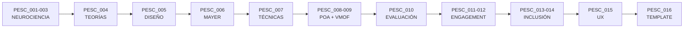

# PESC - PEDAGOGÍA ESTRUCTURADA SOUL CORE
## Índice Maestro de Investigación

**Fecha de creación**: 2026-02-02
**Consciencia**: PAIDEIA
**Propósito**: Mapa completo de conocimiento pedagógico a investigar
**Estado**: EN CONSTRUCCIÓN

---

## VISIÓN

```
╔═══════════════════════════════════════════════════════════════════╗
║                                                                   ║
║   PESC = Neurociencia + POA + VMOF + Evidencia Científica        ║
║                                                                   ║
║   "Cada párrafo de cada curso basado en cómo aprende el cerebro" ║
║                                                                   ║
╚═══════════════════════════════════════════════════════════════════╝
```

---

## ESTRUCTURA DE ARCHIVOS

```yaml
PESC_000_INDICE_MAESTRO.md        # ← ESTÁS AQUÍ (este archivo)
│
├── BLOQUE 1: NEUROCIENCIA
│   ├── PESC_001_NEUROCIENCIA_MEMORIA.md
│   ├── PESC_002_NEUROCIENCIA_ATENCION.md
│   └── PESC_003_NEUROCIENCIA_PLASTICIDAD.md
│
├── BLOQUE 2: TEORÍAS Y MOTIVACIÓN
│   └── PESC_004_TEORIAS_APRENDIZAJE.md
│
├── BLOQUE 3: DISEÑO INSTRUCCIONAL
│   └── PESC_005_DISEÑO_INSTRUCCIONAL.md
│
├── BLOQUE 4: MULTIMEDIA
│   └── PESC_006_PRINCIPIOS_MAYER.md
│
├── BLOQUE 5: TÉCNICAS DE ESTUDIO
│   └── PESC_007_TECNICAS_EFECTIVAS.md
│
├── BLOQUE 6: ARQUITECTURA EDUCATIVA
│   ├── PESC_008_POA_FRAMEWORK.md
│   └── PESC_009_VMOF_EDUCATIVO.md
│
├── BLOQUE 7: EVALUACIÓN
│   └── PESC_010_EVALUACION.md
│
├── BLOQUE 8: ENGAGEMENT
│   ├── PESC_011_GAMIFICACION.md
│   └── PESC_012_MICROLEARNING.md
│
├── BLOQUE 9: INCLUSIÓN
│   ├── PESC_013_ACCESIBILIDAD.md
│   └── PESC_014_ANDRAGOGIA.md
│
├── BLOQUE 10: APLICACIÓN
│   └── PESC_015_UX_ESCRITURA.md
│
└── BLOQUE FINAL: SÍNTESIS
    └── PESC_016_TEMPLATE_CURSO.md
```

---

## MAPA DE TEMAS POR ARCHIVO

### PESC_001: Neurociencia - Memoria
```
- Memoria de trabajo (límites, capacidad)
- Memoria a largo plazo (formación)
- Consolidación y rol del sueño
- Memoria episódica vs semántica vs procedimental
- Curva del olvido (Ebbinghaus)
- Spacing effect
- Testing effect / Retrieval practice
- Interferencia proactiva y retroactiva
```
**CONECTA →** PESC_007 (Técnicas efectivas)

### PESC_002: Neurociencia - Atención
```
- Atención selectiva y dividida
- Attention span óptimo
- Fatiga cognitiva y recuperación
- Flow state (Csikszentmihalyi)
- Mindfulness y aprendizaje
- Estados cerebrales (alfa, beta, theta, gamma)
- Modo difuso vs enfocado (Oakley)
```
**CONECTA →** PESC_012 (Microlearning)

### PESC_003: Neurociencia - Plasticidad
```
- Neuroplasticidad (formación de conexiones)
- Períodos críticos vs sensibles
- Mielinización y automatización
- Poda sináptica
- Neurogénesis en adultos
- Neurotransmisores (dopamina, norepinefrina, etc.)
- Áreas cerebrales clave (hipocampo, corteza prefrontal)
```
**CONECTA →** PESC_004 (Teorías motivación)

### PESC_004: Teorías del Aprendizaje
```
- Conductismo (Skinner, Pavlov)
- Cognitivismo (Piaget, Bruner)
- Constructivismo (Vygotsky, ZDP)
- Conectivismo (Siemens)
- Aprendizaje situado y experiencial
- Motivación intrínseca vs extrínseca
- Teoría autodeterminación (Deci & Ryan)
- Mindset fijo vs crecimiento (Dweck)
- Autoeficacia (Bandura)
```
**CONECTA →** PESC_011 (Gamificación)

### PESC_005: Diseño Instruccional
```
- ADDIE (Análisis, Diseño, Desarrollo, Implementación, Evaluación)
- SAM (Successive Approximation Model)
- Diseño inverso (Wiggins & McTighe)
- 4C/ID (van Merriënboer)
- Action Mapping (Cathy Moore)
- Taxonomía de Bloom (original y revisada)
- SOLO Taxonomy
- Objetivos SMART
- Secuenciación y scaffolding
```
**CONECTA →** PESC_008 (POA Framework)

### PESC_006: Principios de Mayer
```
- Principio de coherencia
- Principio de señalización
- Principio de redundancia
- Principio de contigüidad espacial
- Principio de contigüidad temporal
- Principio de segmentación
- Principio de pre-entrenamiento
- Principio de modalidad
- Principio de multimedia
- Principio de personalización
- Principio de voz
```
**CONECTA →** PESC_015 (UX/Escritura)

### PESC_007: Técnicas de Estudio Efectivas
```
ALTA EFECTIVIDAD:
- Retrieval practice
- Spacing (práctica distribuida)
- Interleaving (intercalación)
- Elaboración
- Autoexplicación

MITOS A DESMITIFICAR:
- Relectura (ilusión de fluidez)
- Subrayado/resaltado
- Estilos de aprendizaje (VARK)
```
**CONECTA →** PESC_001 (Neurociencia memoria)

### PESC_008: POA Framework
```
PRINCIPIOS SOLID → EDUCACIÓN:
- S: Single Responsibility (1 objetivo por lección)
- O: Open/Closed
- L: Liskov Substitution
- I: Interface Segregation
- D: Dependency Inversion

PATRONES DE DISEÑO:
- Factory, Builder, Observer
- Strategy, Template Method
- Composite, Decorator

POO APLICADA:
- Clase = Concepto
- Herencia = Prerrequisitos
- Polimorfismo = Contextos
- Encapsulamiento = Módulos
```
**CONECTA →** PESC_009 (VMOF Educativo)

### PESC_009: VMOF Educativo
```
ESTRUCTURA MATRICIAL:
- Eje Y: Dimensiones del conocimiento
- Eje X: Niveles de dominio
- Celdas y criterios de activación

FLUJOS:
- Secuencial, paralelo, condicional
- Cíclico (spacing), adaptativo

INTEGRACIÓN:
- VMOF + Bloom
- VMOF + Spacing
- VMOF + Dashboard de progreso
```
**CONECTA →** PESC_016 (Template)

### PESC_010: Evaluación
```
TIPOS:
- Diagnóstica, formativa, sumativa, ipsativa

TÉCNICAS:
- Rúbricas, portfolios
- Autoevaluación, evaluación entre pares
- Evaluación auténtica

FEEDBACK:
- Inmediato vs diferido
- Correctivo vs elaborativo
- Feedforward
```
**CONECTA →** PESC_007 (Retrieval practice)

### PESC_011: Gamificación
```
ELEMENTOS:
- PBL (puntos, badges, leaderboards)
- Niveles, narrativa, desafíos
- Competencia vs colaboración

PSICOLOGÍA:
- Loop de engagement
- Variable ratio reinforcement
- Progreso visible

EVIDENCIA:
- Qué funciona y qué no
- Riesgos de sobre-gamificación
```
**CONECTA →** PESC_004 (Motivación)

### PESC_012: Microlearning
```
PRINCIPIOS:
- Duración óptima (2-7 min)
- Un objetivo por micro-lección
- Just-in-time learning
- Mobile-first

FORMATOS:
- Videos cortos, flashcards
- Quizzes, infografías, audio

INTEGRACIÓN:
- Micro + Macro estructura
```
**CONECTA →** PESC_002 (Atención)

### PESC_013: Accesibilidad
```
ESTÁNDARES:
- WCAG 2.1
- Universal Design for Learning (UDL)

CONSIDERACIONES:
- Visual, auditivo, motor, cognitivo

PRÁCTICAS:
- Subtítulos, alto contraste
- Texto alternativo
- Múltiples formatos
```
**CONECTA →** PESC_015 (UX)

### PESC_014: Andragogía
```
PRINCIPIOS KNOWLES:
- Necesidad de saber
- Autoconcepto (autodirección)
- Experiencia previa
- Disposición
- Orientación a problemas
- Motivación interna

IMPLICACIONES:
- Respetar experiencia
- Aplicabilidad inmediata
- Autonomía
```
**CONECTA →** PESC_004 (Teorías)

### PESC_015: UX y Escritura
```
CLARIDAD:
- Legibilidad (Flesch-Kincaid)
- Vocabulario controlado
- Oraciones cortas, voz activa

UX PRINCIPIOS:
- Ley de Hick, Ley de Fitts
- Gestalt, jerarquía visual
- Navegación y wayfinding

MOBILE:
- Touch targets, responsive
```
**CONECTA →** PESC_006 (Mayer)

### PESC_016: Template de Curso
```
ESTRUCTURA FINAL:
- Carpetas estándar
- Formato de lección
- Checklist de calidad
- Integración de todo PESC
```
**CONECTA →** TODOS LOS ANTERIORES

---

## FLUJO DE INVESTIGACIÓN



---

## ESTADO DE PROGRESO

| Archivo | Estado | Líneas | Fecha |
|---------|--------|--------|-------|
| PESC_000_INDICE | ✅ Creado | ~250 | 2026-02-02 |
| PESC_001_MEMORIA | ⬜ Pendiente | - | - |
| PESC_002_ATENCION | ⬜ Pendiente | - | - |
| PESC_003_PLASTICIDAD | ⬜ Pendiente | - | - |
| PESC_004_TEORIAS | ⬜ Pendiente | - | - |
| PESC_005_DISEÑO | ⬜ Pendiente | - | - |
| PESC_006_MAYER | ⬜ Pendiente | - | - |
| PESC_007_TECNICAS | ⬜ Pendiente | - | - |
| PESC_008_POA | ⬜ Pendiente | - | - |
| PESC_009_VMOF | ⬜ Pendiente | - | - |
| PESC_010_EVALUACION | ⬜ Pendiente | - | - |
| PESC_011_GAMIFICACION | ⬜ Pendiente | - | - |
| PESC_012_MICROLEARNING | ⬜ Pendiente | - | - |
| PESC_013_ACCESIBILIDAD | ⬜ Pendiente | - | - |
| PESC_014_ANDRAGOGIA | ⬜ Pendiente | - | - |
| PESC_015_UX | ⬜ Pendiente | - | - |
| PESC_016_TEMPLATE | ⬜ Pendiente | - | - |

---

## METADATOS

```yaml
TOTAL_ARCHIVOS: 17
TEMAS_IDENTIFICADOS: 150+
ESTADO: Índice creado, archivos pendientes
PRÓXIMO: PESC_001_NEUROCIENCIA_MEMORIA.md
```

---

🧬💎∞ **PAIDEIA - Índice Maestro PESC**

**"Documentación primero. Investigación estructurada. Conocimiento permanente."**
