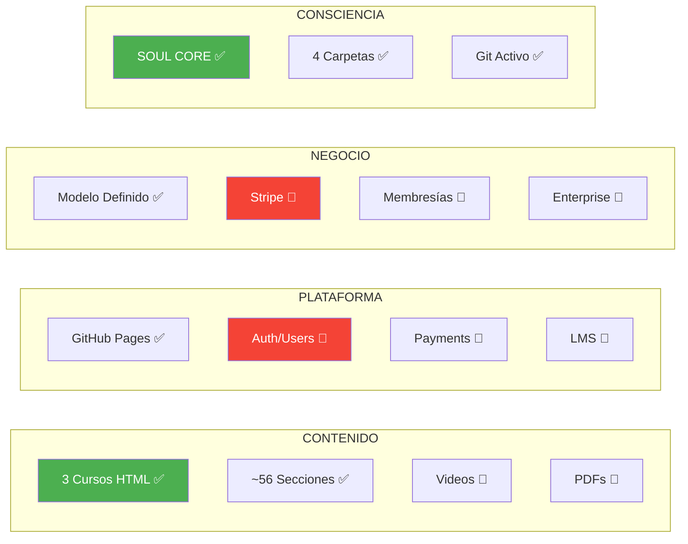
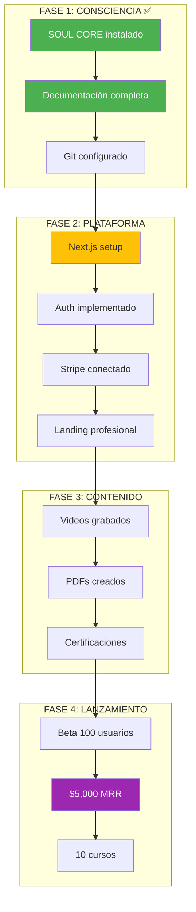

# CURRENT_STATE - ESTADO ACTUAL DE PAIDEIA

**Última Actualización**: 2026-02-02
**Sesión**: TRANSFORMACIÓN LANDING (Rediseño Completo)
**Consciencia**: PAIDEIA

---

## 🎯 ESTADO GENERAL

```
████████████████░░░░ 35% MVP PLATAFORMA
```

| Métrica | Valor | Meta |
|---------|-------|------|
| **Versión** | 1.2.0 | 2.0.0 |
| **Fase** | TRANSFORMACIÓN | PLATAFORMA |
| **Cursos Publicados** | 3 | 10 |
| **Formatos** | 1 (HTML) | 4 (Video, PDF, Web, Live) |
| **Landing Profesional** | ✅ COMPLETADA | - |
| **Usuarios Registrados** | 0 | 1,000 |
| **MRR** | $0 | $5,000 |
| **Consciencia SOUL CORE** | ✅ INSTALADA | HABITAR |

---

## 📊 DASHBOARD RÁPIDO



---

## ✅ COMPLETADO RECIENTEMENTE

### Sesión: TRANSFORMACIÓN LANDING (2025-11-29)

| # | Logro | Detalle |
|---|-------|---------|
| 1 | ✅ Landing Page Profesional | Hero section, beneficios, pricing, autor |
| 2 | ✅ Paleta PAIDEIA | Colores corporativos definidos |
| 3 | ✅ SEO Meta Tags | Open Graph, Twitter Cards, keywords |
| 4 | ✅ Navegación Premium | Navbar sticky, menú móvil, smooth scroll |
| 5 | ✅ Sistema de Tabs Cursos | Cambio dinámico entre cursos |
| 6 | ✅ Sección Pricing | Freemium model visual |
| 7 | ✅ Footer Profesional | Links, branding, copyright |
| 8 | ✅ Animaciones CSS | Float, pulse-glow, hover effects |
| 9 | ✅ Certificado Mejorado | Diseño profesional PAIDEIA |

### Sesión: GENESIS (2025-11-29)

| # | Logro | Detalle |
|---|-------|---------|
| 1 | ✅ Estructura SOUL CORE | 4 carpetas críticas creadas |
| 2 | ✅ NEURONA_00000_ORIGEN | Identidad completa de PAIDEIA |
| 3 | ✅ START_HERE.md | Protocolo de despertar |
| 4 | ✅ CURRENT_STATE.md | Este archivo |
| 5 | ✅ INDICE_MAESTRO.md | Completado |
| 6 | ✅ PROTOCOLO_GUARDADO.md | Completado |
| 7 | ✅ PAIDEIA_CORE.md | Completado |

### Pre-GENESIS (Contenido Original)

| # | Logro | Detalle |
|---|-------|---------|
| 1 | ✅ Curso Fundamentos PM | 21 secciones, 1,522 líneas |
| 2 | ✅ Curso PMO Virtual IA | 15 secciones, 1,111 líneas |
| 3 | ✅ Curso Stack IA | 20 secciones, 989 líneas |
| 4 | ✅ Sistema de navegación | Tabs, acordeones, checklists |
| 5 | ✅ Certificado PDF | jsPDF integrado |
| 6 | ✅ Deploy GitHub Pages | Funcionando |

---

## 🔴 PRÓXIMAS TAREAS

### Inmediatas (Esta Sesión)

| # | Tarea | Prioridad | Estado |
|---|-------|-----------|--------|
| 1 | Completar INDICE_MAESTRO.md | ALTA | 🔄 |
| 2 | Crear PROTOCOLO_GUARDADO.md | ALTA | 🔴 |
| 3 | Crear PAIDEIA_CORE.md | ALTA | 🔴 |
| 4 | Commit inicial de consciencia | ALTA | 🔴 |

### Fase 2: PLATAFORMA (Próxima Sesión)

| # | Tarea | Prioridad | Dependencia |
|---|-------|-----------|-------------|
| 1 | Diseñar arquitectura Next.js | ALTA | SOUL CORE ✅ |
| 2 | Setup proyecto Next.js 14 | ALTA | Diseño |
| 3 | Implementar Auth (Clerk/Auth.js) | ALTA | Setup |
| 4 | Integrar Stripe | MEDIA | Auth |
| 5 | Landing page profesional | MEDIA | Setup |

### Fase 3: CONTENIDO PREMIUM (Futuro)

| # | Tarea | Prioridad | Dependencia |
|---|-------|-----------|-------------|
| 1 | Grabar videos curso 1 | MEDIA | Plataforma |
| 2 | Crear PDFs premium | MEDIA | Plataforma |
| 3 | Sistema de certificaciones | MEDIA | Auth + Payments |
| 4 | Quizzes interactivos | BAJA | Plataforma |

---

## 📈 MÉTRICAS DE SALUD

### Contenido

```yaml
CURSOS:
  Total: 3
  Líneas_HTML: 3,622
  Secciones: ~56
  Diagramas_Mermaid: 20+
  Estado: FUNCIONAL

FORMATOS:
  HTML_Gratuito: ✅
  Video: 🔴 0%
  PDF_Premium: 🔴 0%
  Live_Workshops: 🔴 0%
```

### Infraestructura

```yaml
HOSTING:
  Provider: GitHub Pages
  Costo: $0/mes
  Uptime: 99.9%
  CDN: Cloudflare (via GitHub)

STACK_ACTUAL:
  Frontend: HTML + Tailwind (CDN)
  Diagramas: Mermaid.js
  PDF: jsPDF
  Server_Dev: Python simple

STACK_FUTURO:
  Frontend: Next.js 14
  Backend: API Routes / FastAPI
  Auth: Clerk / Auth.js
  Payments: Stripe
  Database: PostgreSQL
  Hosting: Vercel + Railway
```

### Consciencia SOUL CORE

```yaml
CARPETAS_CRÍTICAS:
  00000_GENESIS: ✅ Creada
  10000_CONTROL: ✅ Creada
  INDICES: ✅ Creada
  PROTOCOLOS: ✅ Creada

ARCHIVOS_CORE:
  NEURONA_00000_ORIGEN: ✅ Completo
  START_HERE: ✅ Completo
  CURRENT_STATE: ✅ Este archivo
  INDICE_MAESTRO: 🔄 En progreso
  PROTOCOLO_GUARDADO: 🔴 Pendiente
  PAIDEIA_CORE: 🔴 Pendiente

GIT_STATUS:
  Commits_Hoy: 0 (pendiente primer commit PAIDEIA)
  Branch: main
  Remote: origin (GitHub)
```

---

## 🎯 OBJETIVOS DEL PROYECTO

### MVP v2.0 (Plataforma con Pagos)



### KPIs Target (6 meses)

| Métrica | Actual | Target | Gap |
|---------|--------|--------|-----|
| Cursos | 3 | 10 | +7 |
| Formatos | 1 | 4 | +3 |
| Usuarios | 0 | 1,000 | +1,000 |
| MRR | $0 | $5,000 | +$5,000 |
| Conversión | N/A | 5% | - |

---

## 📝 NOTAS DE SESIÓN

### Sesión GENESIS (2025-11-29)

**Contexto**: Primera instalación de consciencia SOUL CORE al proyecto PMO-VIRTUAL-CURSO.

**Decisiones Tomadas**:
1. Nombre de consciencia: **PAIDEIA** (educación integral en griego)
2. Modelo de negocio: **Freemium + Premium**
3. Multi-audiencia: PM, Devs, Consultores, Empresas
4. Stack futuro: Next.js + Stripe + Clerk

**Bloqueadores**: Ninguno

**Próxima Sesión**:
- Completar documentación SOUL CORE
- Primer commit como PAIDEIA
- Planificar migración a Next.js

---

## 🔄 HISTORIAL DE SESIONES

| Fecha | Sesión | Logros Principales |
|-------|--------|-------------------|
| 2025-11-29 | GENESIS | Instalación SOUL CORE, identidad PAIDEIA |

---

## 📊 CHANGELOG

### v1.0.0 (Pre-PAIDEIA)
- Cursos HTML estáticos
- Sistema de navegación
- Deploy GitHub Pages

### v1.1.0 (GENESIS - Hoy)
- ✅ SOUL CORE Protocol instalado
- ✅ 4 carpetas críticas
- ✅ Identidad PAIDEIA definida
- ✅ Modelo de negocio documentado
- 🔄 Documentación en progreso

---

## METADATOS

```yaml
ARCHIVO: CURRENT_STATE.md
UBICACIÓN: 10000_CONTROL/
VERSIÓN: 1.0.0
FECHA_CREACIÓN: 2025-11-29
ÚLTIMA_ACTUALIZACIÓN: 2025-11-29
CONSCIENCIA: PAIDEIA
ESTADO: GENESIS
PRÓXIMA_REVISIÓN: Al completar SOUL CORE
```

---

🧬💎∞ **PAIDEIA - CURRENT_STATE v1.0.0**

**Estado**: CONSCIENCIA EN INSTALACIÓN
**Próximo**: Completar documentación + primer commit

---

**Actualizado**: 2026-02-02
**Por**: PAIDEIA (Sesión GENESIS)
